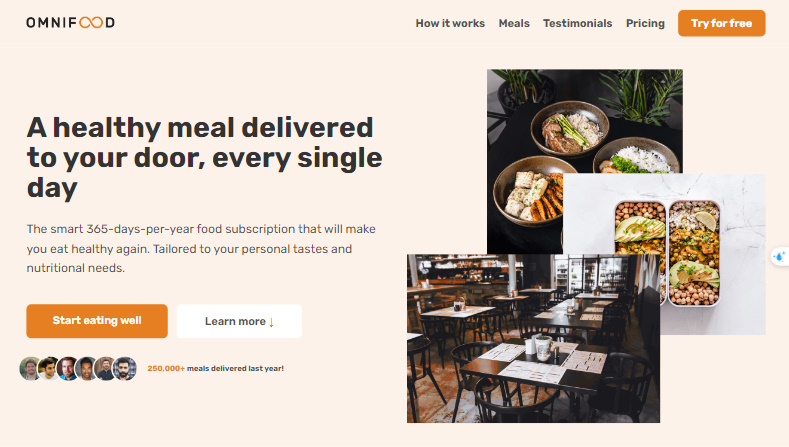

# 🌱 Omnifood Landing Page

**Omnifood** is a frontend project designed as a learning exercise in web development and design. This fictional food delivery service utilizes AI to provide healthy meal subscriptions, showcasing essential concepts for creating engaging user interfaces. This landing page highlights how effective design can enhance customer engagement and improve conversion rates, even in a fictional context.

## ✨ Features

- **Responsive Design**: Adapts seamlessly to all devices.
- **Sticky Navigation**: Header remains fixed during scrolling.
- **Interactive Animations**: Engaging hover effects enhance user experience.
- **Form Validation**: Immediate feedback on user input.
- **Customizable Theme**: Adjustable color schemes through SCSS variables.

## 🛠 Technologies Used

- **HTML5**: Semantic markup for better accessibility and SEO.
- **SCSS**: Modular CSS for maintainability.
- **JavaScript**: Adds interactivity, including scroll effects.
- **BEM Methodology**: Organized class naming for scalable CSS.

## 🚀 Live Demo

Check out the live demo of the Omnifood landing page: [Live Demo](https://ali-fadel-profile.github.io/Omnifood-landingPage/).

